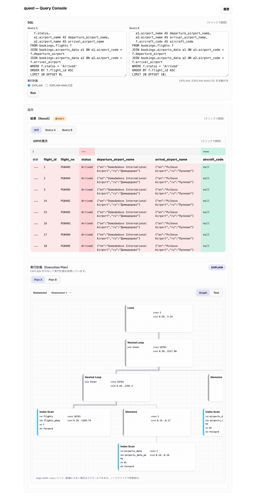
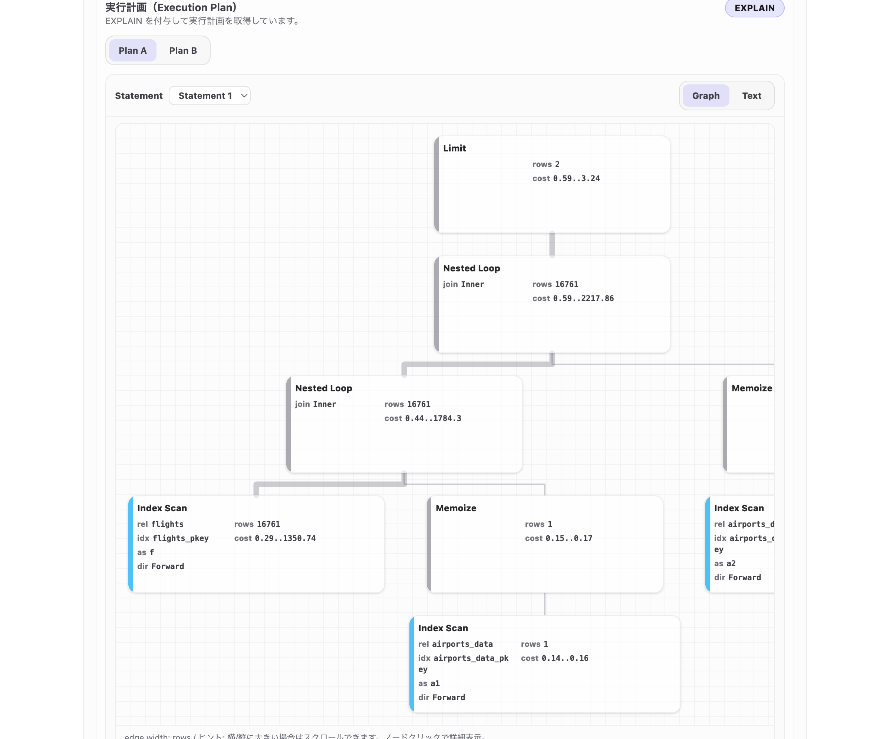
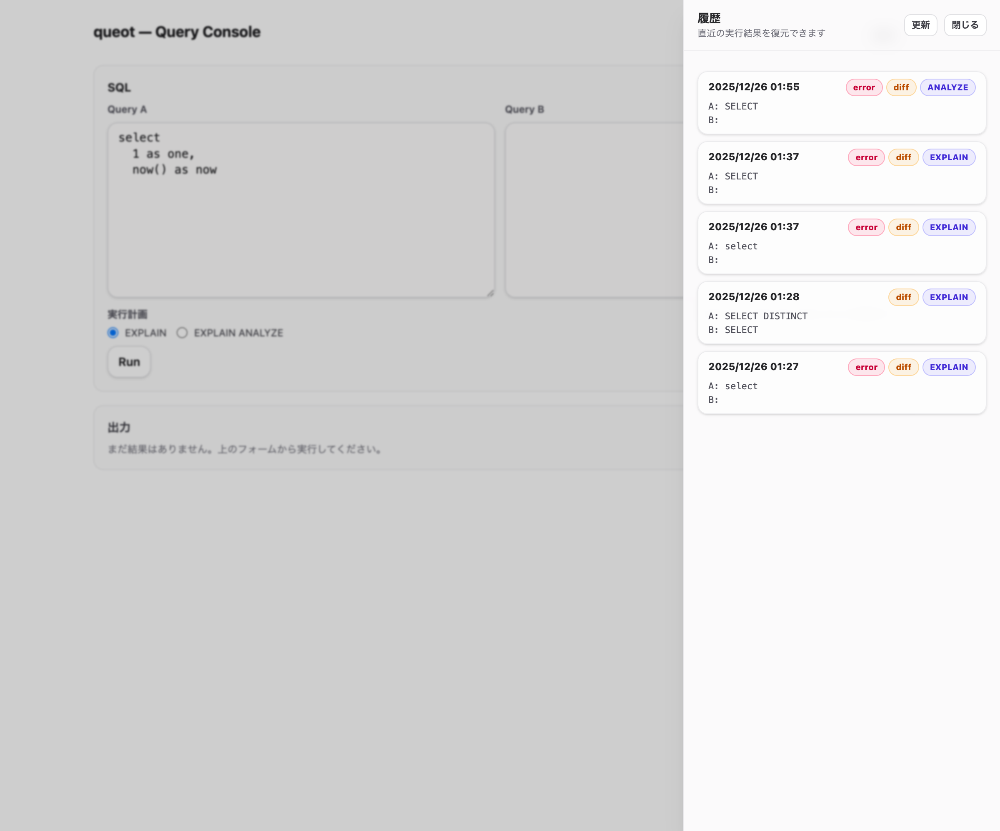

# queot

[](LICENSE)
[](https://nodejs.org/)

**SQL Query Optimization Tool** — 2つのクエリを並列実行し、結果の差分と実行計画を比較することで、SQLの最適化を支援するツールです。



## ✨ Features

- **並列クエリ比較** — Query A / Query B を同時に実行し、結果を比較
- **差分ビュー** — 行の追加・削除・変更、列の追加を色分け表示
- **実行計画の可視化** — EXPLAIN / EXPLAIN ANALYZE をグラフとテキストで表示
- **実行履歴** — 過去の試行を保存し、いつでも復元可能

## 📦 Requirements

- Node.js 24+

## 🗄️ Supported Databases

| データベース | サポートバージョン | テスト済みバージョン |
|-------------|-------------------|---------------------|
| PostgreSQL | [node-postgres](https://node-postgres.com/) がサポートするバージョン | 18.1 |

## 🚀 Quick Start

```bash
npx @sun-yryr/queot serve -p 5432 -u postgres -d demo

# ポートを固定したい場合（例: 3000）
npx @sun-yryr/queot serve --db-name demo --listen-port 3000
```

起動後、デフォルトでは空きポートにバインドし、ブラウザが自動で開きます（`--listen-port` で固定可能）。

### CLI オプション

| フラグ | 短縮 | デフォルト | 説明 |
|--------|------|------------|------|
| `--db-host` | `-h` | `localhost` | 接続先ホスト |
| `--db-port` | `-p` | `5432` | 接続先ポート |
| `--db-username` | `-u` | `postgres` | ユーザー名 |
| `--db-name` | `-d` | `postgres` | データベース名 |
| `--listen-port` | `-l` | 自動選択 | サーバー待受ポート |

### 環境変数

| 変数 | 説明 | デフォルト |
|------|------|------------|
| `DBPASSWORD` | PostgreSQLパスワード（未指定の場合は起動時にプロンプト表示） | - |

## 📖 Usage

### 基本的な使い方

1. **Query A** に元のクエリを入力
2. **Query B** に最適化したクエリを入力
3. 実行計画オプション（EXPLAIN / EXPLAIN ANALYZE）を選択
4. **Run** をクリックして実行

### 差分の見方

結果タブでは、2つのクエリ結果の差分が色分けされます：

| 記号 | 色 | 意味 |
|------|-----|------|
| `---` | 🔴 赤 | Query A のみに存在する行（削除） |
| `+++` | 🟢 緑 | Query B のみに存在する行（追加） |
| `->` | 🟡 黄 | 同一キーで値が変化した行（更新） |

列の差分も自動検出され、Query B で追加された列は緑色で表示されます。

### 実行計画の比較

Plan タブでは、両クエリの実行計画を並べて比較できます：

- **Graph**: 実行計画をツリー構造で可視化
- **Text**: PostgreSQLの生の EXPLAIN 出力を表示



### 履歴機能

右上の「履歴」ボタンから過去の実行を復元できます：



## 🏗️ Architecture

```
queot/
├── packages/
│   ├── queot/          # メインアプリケーション
│   │   ├── src/
│   │   │   ├── client/ # React フロントエンド
│   │   │   ├── routes/ # API エンドポイント
│   │   │   └── services/ # ビジネスロジック
│   │   └── ...
│   └── planparser/     # PostgreSQL EXPLAIN パーサー
└── ...
```

## 🤝 Contributing

TBW

## 📄 License

This project is licensed under the MIT License - see the [LICENSE](LICENSE) file for details.

## 🙏 Acknowledgements

- [Daff](https://github.com/paulfitz/daff) — テーブル差分の計算・表示に使用しています

